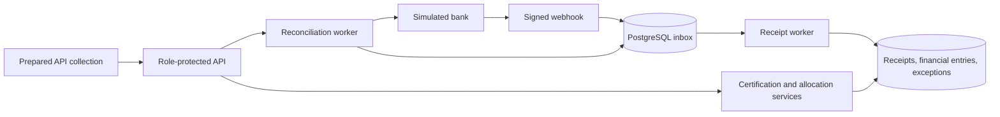

# System Design

## Architecture

One Java/Spring Boot application, one PostgreSQL database, and a deterministic simulated bank adapter. Use explicit SQL/JDBC for money transactions and locking, schema migrations, and a database-backed worker. No broker or microservices are required.

All boxes except the bank and database are modules in the same application. The bank simulator is a separate lightweight local process with fixed fixtures and fault controls.

## Components

| Component | Responsibility |
| --- | --- |
| API/security | Validation, role enforcement, request idempotency, HMAC verification. |
| Certification service | Freeze approved net amount and create one demand in one transaction. |
| Inbox/receipt worker | Durable receipt ingestion, deduplication, matching, retry. |
| Allocation service | Shared locking, balance checks, manual allocation and reversal. |
| Worklist queries | Compute balances from immutable receipts and signed financial entries. |
| Reconciliation worker | Compare a complete bank snapshot with local receipts; recover missing records and expose disagreements. |
| Exception service | Explain unallocated funds and bank discrepancies; preserve notes and resolution history. |

## Data flow

### Certification

Authorize certifier → validate amount/reference → lock milestone → save certification facts and demand → commit. A unique milestone constraint prevents duplicate demands. An idempotency key makes response-loss retries safe.

### Webhook and receipt processing

1. Verify HMAC over the timestamp and raw body before parsing. Reject timestamps outside a five-minute tolerance. The simulator re-signs each retry with a fresh delivery timestamp.
2. Validate and map the minimal receipt data to the configured bank account/project/client. Do not trust a caller-supplied project identifier.
3. Insert an inbox row, unique by `(source, event_id)`, and commit before returning `202`. Same event ID with changed canonical receipt fields is a conflict; never overwrite the original.
4. Worker selects one due row with `FOR UPDATE SKIP LOCKED` and holds its lock during the short database-only processing transaction. No external call occurs inside it.
5. Insert receipt under unique `(source, bank_receipt_id)`. If it already exists, compare canonical fields: identical means a no-op; different means a bank-record conflict exception, without another receipt or allocation.
6. For a new receipt, append a `RECEIPT` entry. Lock its receipt row, then the matching demand row. Recompute balances under locks and append an allocation for `min(unallocated, outstanding)`.
7. Create/update any residual-funds exception and mark the inbox row processed in the same transaction. If anything fails, roll back all of step 5–7.

Transient errors receive persisted retry metadata after rollback, with capped exponential backoff. After five failed attempts, mark the inbox row `FAILED` and expose a manager retry action. A crashed transaction releases its locks; the original pending row remains available. No persistent `PROCESSING` claim can strand an inbox item.

### Manual allocation and reversal

Lock receipt first, then demand; every allocation path uses that order. Recompute net allocated amounts and enforce project/client/currency and both balance limits. Append entries, update residual-funds exceptions, and save the idempotent response in one transaction.

Reversal appends an equal, opposite entry linked to one original allocation. A unique reversal reference prevents a second reversal. It reopens outstanding/unallocated balances and creates or reopens the relevant receipt exception. It does not trigger automatic rematching. Reallocation is a separate explicit request.

### Reconciliation

1. Return a run ID and persist a queued job. Permit only one active run per source/project.
2. Fetch a stable, paginated snapshot with an `asOf` time and complete account history through that time. Persist pages and the cursor; resume after restart. A run lease expires after worker failure.
3. Stage bank records in a run-scoped table. Only after every page is available, compare canonical receipt fields and enqueue missing receipts with deterministic recovery event IDs.
4. A bank/local field mismatch creates `BANK_RECORD_CONFLICT`. A local receipt absent from the full bank snapshot creates `LOCAL_RECEIPT_NOT_IN_BANK`; restrict this comparison to receipts posted and locally recorded by `asOf`. Never delete or change money.
5. Wait until recovery inbox rows reach terminal outcomes, then finalize counts. Use `COMPLETED` when all processing succeeded (even if exceptions exist), otherwise `COMPLETED_WITH_ERRORS`. Fetch failure after retries produces `FAILED`, with the failure visible and no claim of a complete comparison.

Compare stable source IDs and canonical fields, not just totals. Repeating a run or racing a webhook is safe because both converge on the same receipt uniqueness constraint. Consistency of the simulated bank snapshot is part of the adapter contract; do not assume every real bank provides it.

## External services

- **Simulated bank:** signed webhooks plus `GET /receipts?snapshotId=...&cursor=...`; first response returns immutable `snapshotId`, `asOf`, receipt items, and `nextCursor`. Supports omitted/duplicate notifications and unavailable-page scenarios. No actual banking connection.
- **Optional accounting receiver:** only for the outbox extension. Certification writes `DemandCreated` to an outbox in its transaction. A publisher retries delivery; the receiver deduplicates by event ID. Delivery is at least once, never claimed as exactly once.
- No email, payment gateway, identity provider, or external queue in MVP.

## Failure cases

| Failure | Required behavior |
| --- | --- |
| Database unavailable during webhook acceptance | Return `503`; sender retries. Never acknowledge uncommitted work. |
| Same receipt, new delivery event IDs | Unique receipt identity yields one financial result. |
| Simultaneous allocations | Receipt-then-demand locks serialize balance checks; reject excess manual requests. |
| Crash during financial writes | Entire transaction rolls back; durable inbox can retry. |
| Commit succeeds but HTTP response is lost | Same idempotency key returns the original result. |
| Unknown reference or overpayment | Keep residual money unallocated with an open exception. |
| Bank changes a recorded receipt | Preserve original money and open a discrepancy. |
| Bank pagination fails | Resume/retry or fail the run; never infer missing bank receipts from a partial list. |
| Operator acknowledges a discrepancy | Store note/actor; no financial mutation or automatic closure. |
| Optional outbox delivery succeeds before publisher crashes | Resend same event; receiver deduplicates. |

Use real PostgreSQL integration tests with concurrent requests, transaction fault injection, and application restart. Log correlation IDs, source receipt IDs, run outcomes, and retry counts only. Monitor pending/failed inbox counts and open exceptions through the operational APIs.
