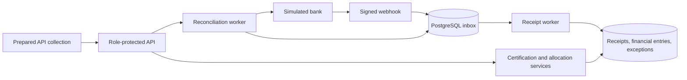

# System Design

## Architecture

One Java/Spring Boot application, one PostgreSQL database, and a deterministic simulated bank adapter. Use explicit SQL/JDBC for money transactions and locking, schema migrations, and a database-backed worker. No broker or microservices are required.

All boxes except the bank and database are modules in the same application. The bank simulator is a separate lightweight local process with fixed fixtures and fault controls.

## Components

| Component | Responsibility |
| --- | --- |
| API/security | Validation, role enforcement, request idempotency, HMAC verification. |
| Certification service | Freeze approved net amount and create one demand in one transaction. |
| Inbox/receipt worker | Durable receipt ingestion, deduplication, matching, retry. |
| Allocation service | Shared locking and balance checks for automatic and manual allocation; reversal is deferred. |
| Worklist queries | Compute balances from immutable receipts and signed financial entries. |
| Reconciliation worker | Compare a complete bank snapshot with local receipts; recover missing records and expose disagreements. |
| Exception service | Explain unallocated funds and bank discrepancies; preserve notes and resolution history. |

## Day 1 setup slice

`GET /api/v1/projects` and `GET /api/v1/projects/{projectId}/milestones` are read-only JDBC queries scoped to the configured project UUID. All three configured roles have those reads; manager has no implied certification authority. Password hashes are supplied as BCrypt configuration, while the raw demo passwords stay outside source control. Correlation handling runs before security so rejected authentication attempts receive `X-Request-Id`. `/api/v1/health/live` is process-only; `/api/v1/health/ready` performs a database query and returns only a minimal status.

## Data flow

### Certification

Authorize certifier → validate amount/reference → lock milestone → save certification facts and demand → commit. A unique milestone constraint prevents duplicate demands. An idempotency key makes response-loss retries safe.

**Implemented Day 2 boundary:** the actor/operation/key row is inserted with PostgreSQL `ON CONFLICT DO NOTHING`; a conflicting request then locks and reads the existing row. A completed matching request replays its stored status/body. A new request locks the scoped milestone, writes certification facts, demand, audit event, and completed idempotency response in one transaction. The runtime role has only certification-column update privileges, and a trigger prevents later posted-fact changes.

### Webhook and receipt processing

1. Verify HMAC over the timestamp and raw body before parsing. Reject timestamps outside a five-minute tolerance. The simulator re-signs each retry with a fresh delivery timestamp.
2. Validate and map the minimal receipt data to the configured bank account/project/client. Do not trust a caller-supplied project identifier.
3. Insert an inbox row, unique by `(source, event_id)`, and commit before returning `202`. Same event ID with changed normalized receipt fields is a conflict; never overwrite the original. Existing inbox replay hashes remain unchanged and are not treated as receipt hashes; field comparison preserves compatibility with V5 rows.

**Implemented Day 3 flow:** a bounded scheduled worker uses `FOR UPDATE SKIP LOCKED` on due `PENDING` rows. Its database-only transaction locks the receipt before any matching demand, creates immutable receipt and entry facts, appends at most `min(available, outstanding)` exact-reference allocation, records/reopens residual or conflict exceptions, links the inbox event, and marks it terminal. Any failure rolls the transaction back. A new transaction records 1/2/4/8-second retry metadata and marks the fifth failure `FAILED`; no durable processing claim exists, so a crash leaves pending work recoverable.
4. Worker selects one due row with `FOR UPDATE SKIP LOCKED` and holds its lock during the short database-only processing transaction. No external call occurs inside it.
5. Insert receipt under unique `(source, bank_receipt_id)`. Its independent fact hash includes trusted source/project/account, receipt identity, amount, currency, nullable exact reference, and the database-normalized posting timestamp. If it already exists, identical facts mean a no-op that links the delivery; different facts mean a terminal bank-record conflict exception without another receipt or allocation. Duplicate delivery never triggers rematching.
6. For a new receipt, append a `RECEIPT` entry. Lock its receipt row, then the matching demand row. Recompute balances under locks and append an allocation for `min(unallocated, outstanding)`.
7. Create/update any residual-funds exception and mark the inbox row processed in the same transaction. If anything fails, roll back all of step 5–7.

Transient errors receive persisted retry metadata after rollback, with 1/2/4/8-second delays. After five failed attempts, mark the inbox row `FAILED`; invalid persisted facts fail immediately with a safe code. Failure recording updates only a still-`PENDING` row, so a late recorder cannot overwrite another worker's success. Manager retry locks/resets a failed row, records a reasoned audit event, and stores an idempotent `202` response. If failure recording is itself unavailable, log a safe code and leave pending work recoverable. A crashed transaction releases its locks; the original pending row remains available. No persistent `PROCESSING` claim can strand an inbox item. Successful processing logs are emitted only after commit, with inbox/receipt/demand/exception IDs, attempt count, and duration.

### Manual allocation (Day 4) and deferred reversal

Lock receipt first, then demand; automatic exact-reference and manual allocation share the same locking, balance calculation, and entry insertion service. Manual allocation validates its complete requested amount after checking receipt availability before demand availability. It appends the entry, resolves only an open residual-funds case when the receipt reaches zero unallocated balance, appends audit evidence, and saves the idempotent response in one transaction. Bank-record conflicts are never auto-resolved by allocation or notes. Notes are append-only audit events on the exception and do not change money or status.

The proposed later reversal flow would append an equal, opposite entry linked to one original allocation. It would reopen outstanding/unallocated balances and create or reopen the relevant receipt exception without automatic rematching. Reversal and reallocation are not implemented in the five-day MVP; posted allocations cannot yet be corrected through its API.

### Reconciliation

1. An accounts user or manager creates a run. The idempotency response, run with actor/request ID, and initiating audit event commit together. A partial unique index permits one queued/running run per configured source/project. A duplicate key replays the original accepted run.
2. The scheduled worker claims one due run with `FOR UPDATE SKIP LOCKED`, a random instance owner, an incremented lease version, and a 15-second expiry. Every progress transaction checks owner, version, status, phase, and unexpired lease before writing. A crashed or expired worker cannot commit stale progress. Each step releases its lease after commit; restart or another worker claims the persisted phase.
3. `FETCH` calls `GET /receipts` or `GET /receipts?cursor=...` outside a transaction with two-second connect and three-second request timeouts. The response reader cancels once the 1 MiB limit is exceeded; pages contain at most 100 items and runs at most 1,000 pages. Every page must retain the same snapshot ID and `asOf`; receipt identifiers and amounts must be valid, control characters are rejected, INR only, posting time no later than `asOf`, and cursor values cannot repeat. A page transaction stages distinct canonical facts and the next cursor together. Identical repeated records are harmless; changed facts under one identity fail the run. A transient fetch failure persists five-attempt 1/2/4/8-second backoff; expired, malformed, or database-invalid snapshot facts fail immediately. An incomplete snapshot never enters comparison.
4. `COMPARE` processes staged identities in small database transactions. It uses the same receipt-fact hash as the receipt processor. A missing identity enqueues a deterministic `RECOVERY` inbox event through the shared inbox persistence service. HMAC verification remains exclusive to webhook HTTP requests. Receipt processing alone creates financial entries and allocations; its unique bank identity handles webhook races. An existing identity with changed facts opens `BANK_RECORD_CONFLICT` without editing money. A matching identity can resolve a prior bank discrepancy only when that case was last observed before this run began and no later than the snapshot's `asOf`; a newer webhook observation stays open. Resolution retains audit evidence and run association.
5. After all staged items, `ABSENCE` compares only configured source/project receipts both posted and locally recorded by `asOf`, in batches of at most 100 using a committed receipt-ID cursor. Missing identities open `LOCAL_RECEIPT_NOT_IN_BANK`; only a later complete matching snapshot resolves them. Residual-funds cases are unaffected. Comparison writes exceptions, audit rows, associations, inbox events, and phase transitions transactionally, without a network call.
6. `WAIT` remains active until linked recovery events are terminal. Finalization locks linked inbox rows while checking their status, so a manager retry cannot change a failed event between the terminal check and count persistence. Finalization counts only recovery events that actually created a `RECEIPT` entry for `recoveredCount`; a webhook win is excluded. Failed event IDs and counts are frozen in the completed run even if the event is later retried. A complete comparison is `COMPLETED` despite open discrepancies; failed recovery processing is `COMPLETED_WITH_ERRORS`. Fetch failure is `FAILED`, with no absence-based changes.

The simulator provides stable fixture responses during an application restart; the worker verifies the snapshot identity across resumed pages. A real bank adapter would need a contractual guarantee that a snapshot ID pins the complete history through `asOf`. The local simulator does not provide a production bank completeness guarantee.

## External services

- **Simulated bank:** signed webhooks plus `GET /receipts` and cursor pages at `GET /receipts?cursor=...`; every response carries `snapshotId`, `asOf`, receipt items, and `nextCursor`. Static cursor fixtures produce unavailable, expired, and malformed pages; the private WireMock admin API is used by the local demo. No actual banking connection.
- **Optional accounting receiver:** only for the outbox extension. Certification writes `DemandCreated` to an outbox in its transaction. A publisher retries delivery; the receiver deduplicates by event ID. Delivery is at least once, never claimed as exactly once.
- No email, payment gateway, identity provider, or external queue in MVP.

## Failure cases

| Failure | Required behavior |
| --- | --- |
| Database unavailable during webhook acceptance | Return `503`; sender retries. Never acknowledge uncommitted work. |
| Same receipt, new delivery event IDs | Unique receipt identity yields one financial result. |
| Simultaneous allocations | Receipt-then-demand locks serialize balance checks; reject excess manual requests. |
| Crash during financial writes | Entire transaction rolls back; durable inbox can retry. |
| Commit succeeds but HTTP response is lost | Same idempotency key returns the original result. |
| Unknown reference or overpayment | Keep residual money unallocated with an open exception. |
| Bank changes a recorded receipt | Preserve original money and open a discrepancy. |
| Bank pagination fails | Resume/retry or fail the run; never infer missing bank receipts from a partial list. |
| Operator acknowledges a discrepancy | Store note/actor; no financial mutation or automatic closure. |
| Optional outbox delivery succeeds before publisher crashes | Resend same event; receiver deduplicates. |

Use real PostgreSQL integration tests with concurrent requests, transaction fault injection, and application restart. Log correlation IDs, source receipt IDs, run outcomes, and retry counts only. Monitor pending/failed inbox counts and open exceptions through the operational APIs.
